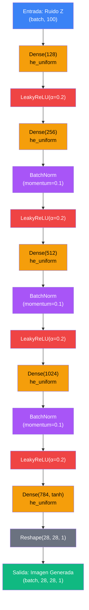
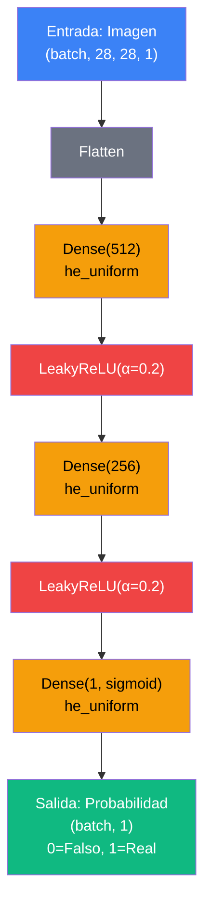
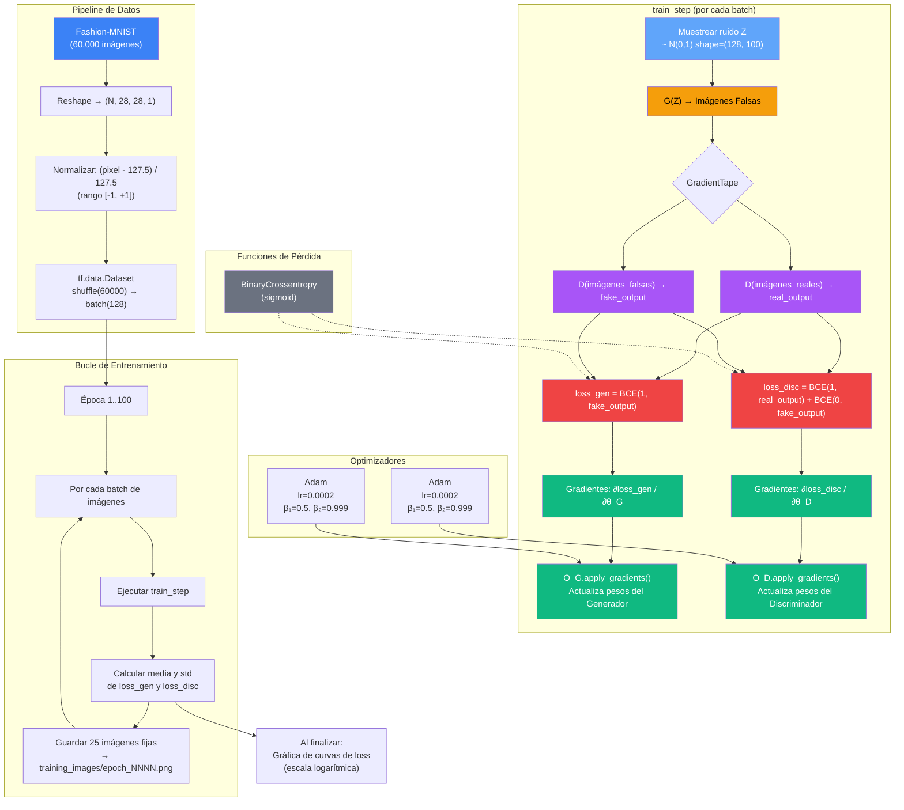

# Documentación GAN - Fashion MNIST

## Arquitectura del Generador

**Resumen de capas:**

| # | Capa | Forma de salida |
|---|------|-----------------|
| 1 | Dense(128) + he_uniform | (batch, 128) |
| 2 | LeakyReLU(0.2) | (batch, 128) |
| 3 | Dense(256) + he_uniform | (batch, 256) |
| 4 | BatchNormalization | (batch, 256) |
| 5 | LeakyReLU(0.2) | (batch, 256) |
| 6 | Dense(512) + he_uniform | (batch, 512) |
| 7 | BatchNormalization | (batch, 512) |
| 8 | LeakyReLU(0.2) | (batch, 512) |
| 9 | Dense(1024) + he_uniform | (batch, 1024) |
| 10 | BatchNormalization | (batch, 1024) |
| 11 | LeakyReLU(0.2) | (batch, 1024) |
| 12 | Dense(784, tanh) + he_uniform | (batch, 784) |
| 13 | Reshape(28, 28, 1) | (batch, 28, 28, 1) |

---

## Arquitectura del Discriminador (Antagónico)

**Resumen de capas:**

| # | Capa | Forma de salida |
|---|------|-----------------|
| 1 | Flatten | (batch, 784) |
| 2 | Dense(512) + he_uniform | (batch, 512) |
| 3 | LeakyReLU(0.2) | (batch, 512) |
| 4 | Dense(256) + he_uniform | (batch, 256) |
| 5 | LeakyReLU(0.2) | (batch, 256) |
| 6 | Dense(1, sigmoid) + he_uniform | (batch, 1) |

---

## Flujo de Entrenamiento

**Resumen del entrenamiento:**

| Componente | Detalle |
|------------|---------|
| Pérdida | BinaryCrossentropy (sigmoid) |
| Pérdida del Generador | `BCE(label=1, D(G(Z)))` — engañar al Discriminador |
| Pérdida del Discriminador | `BCE(1, D(real)) + BCE(0, D(fake))` — clasificar correctamente |
| Optimizador | Adam (lr=0.0002, β₁=0.5, β₂=0.999) — uno por modelo |
| Ratio G:D | 1 : 1 (un paso de gradiente por modelo por batch) |
| Batch size | 128 |
| Épocas | 100 |
| Fijación de ruido | Semilla=42, 25 vectores fijos para visualizar progreso |
